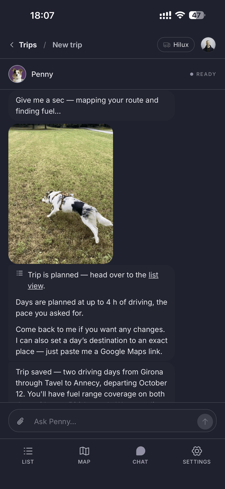
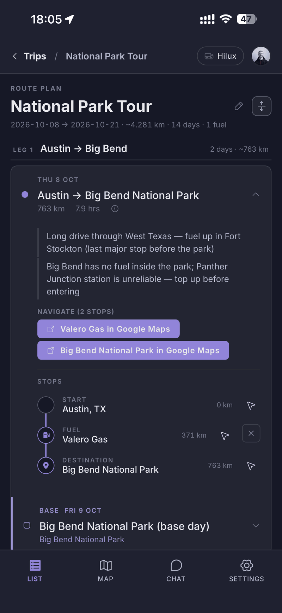
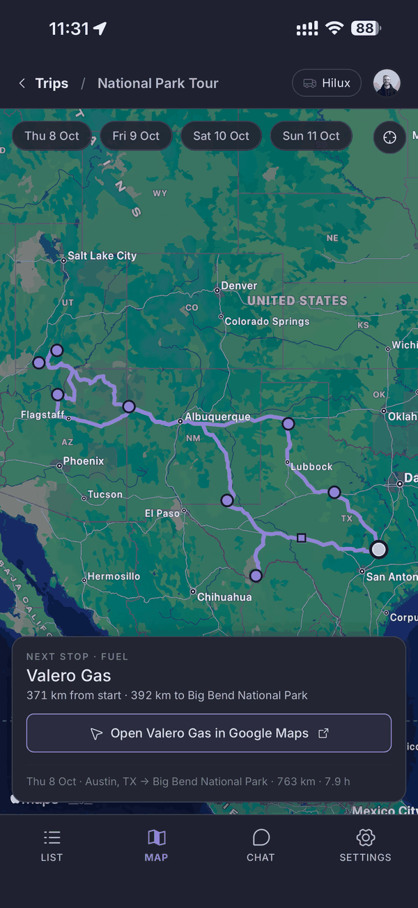

# Feral Travels

AI trip planner for overlanders. You tell **Penny** (a Claude tool-use agent) where you're going and how far you want to drive each day; she builds a dated, day-by-day itinerary with routes and rest days, and **Finn** (a deterministic fuel engine) finds gas stations your vehicle can actually reach along each day's route. You then edit the plan entirely by chatting — the itinerary list and map are read views anchored to your live GPS position.

<p align="left">
  
  
  
</p>

Live at [feraltravels.com](https://www.feraltravels.com) (web + PWA). A native iOS client lives in [`mobile/`](mobile/) (Expo / React Native, in TestFlight ahead of App Store submission).

> **Deep reference:** [`CLAUDE.md`](CLAUDE.md) is the authoritative map of the codebase — architecture, schema, Penny tools, invariants, and the history behind every non-obvious decision. This README is the short version.

## What it does (MVP scope)

- **Chat-first planning.** Deterministic onboarding (vehicle name + fuel range) runs *before* any LLM call. Then one sentence — "Girona to Lisbon, 3 days in Porto, 3 in Lisbon, 5 h driving max" — becomes a full multi-day plan in one turn.
- **Two stop types only.** `fuel` (found automatically by Finn) and `other` (a place the user adds by pasting a Google/Apple Maps link, an address, or a place name). Penny does not discover campgrounds, groceries, etc.
- **Fuel that respects physics.** Finn never routes a dry stretch past the vehicle's `range_km`, carries tank state across days, and attaches a one-line reason to every forced stop. Fuel is sourced lazily when a day is opened and cached 48 h.
- **Adaptive on the road.** `report_position` re-anchors the trip to where the driver actually is; `declare_fuel_state` records "I only have 150 km in the tank"; the itinerary collapses days behind you.
- **Admin dashboard** at `/admin` (hardcoded allowlist): users, trips, chat volume, per-request AI cost, Google usage.

## Stack

| Layer | Choice |
|---|---|
| Web | Next.js 14 (App Router), React 18, TypeScript, CSS Modules, PWA service worker |
| iOS | Expo SDK 54 / React Native, expo-router, react-native-maps — pure client of the same API (`mobile/`) |
| API | 61 REST routes; every route accepts one Zod-validated payload; all DB access through `src/server/repos/*` |
| DB | Neon Postgres via Drizzle ORM (33 tables, migrations in `drizzle/`) |
| Auth | NextAuth v5 — email OTP, Google OAuth, and Sign in with Apple; mobile uses the same flows and gets a bearer token stored in the iOS Keychain |
| AI | Anthropic SDK, tool use, 21 Penny tools in `src/lib/penny/tools/`; model IDs in `src/lib/models.ts` |
| Maps | Google Maps Platform — **one key** (`NEXT_PUBLIC_GOOGLE_MAPS_API_KEY`) for the browser SDK, server Directions, and Places (New) search-along-route / text search |
| Email | Resend |
| Payments | Apple IAP via RevenueCat; entitlement lives server-side in `src/server/payments/` |
| Tests | Vitest (1,955 tests in 163 spec files), Playwright (web e2e), Maestro (iOS e2e on a simulator) |
| Hosting | Vercel + Neon branches; GitHub Actions CI — merge to `main` deploys |

## Quick start

```bash
npm install
cp .env.example .env     # fill in the vars below
npm run db:migrate       # apply Drizzle migrations to your Neon DB
npm run dev              # http://localhost:3000
```

Required env (see `.env.example` for comments):

```
DATABASE_URL                     Neon pooled connection string
AUTH_SECRET                      openssl rand -base64 32
AUTH_URL                         http://localhost:3000 locally
AUTH_GOOGLE_ID / AUTH_GOOGLE_SECRET
AUTH_RESEND_KEY / AUTH_EMAIL_FROM
ANTHROPIC_API_KEY
NEXT_PUBLIC_GOOGLE_MAPS_API_KEY  enable Maps JS, Directions, and "Places API (New)" on it
```

For the iOS app, payments and Apple sign-in:

```
REVENUECAT_WEBHOOK_SECRET        shared secret for POST /api/webhooks/revenuecat; unset = the route answers 503
AUTH_APPLE_ID / AUTH_APPLE_SECRET  web Sign in with Apple; the button renders only when both are set
                                 (the secret is a JWT that expires — regenerate with scripts/generate-apple-client-secret.ts)
APPLE_APP_BUNDLE_ID              audience for native Apple identity tokens (defaults to com.feraltravels.ios)
AUTH_GOOGLE_IOS_CLIENT_ID        audience for native Google identity tokens
NEXT_PUBLIC_APP_STORE_URL        the web soft block's "Continue on iPhone"; falls back to an App Store search
```

Optional: `ADMIN_EMAILS` (can only *restrict* the hardcoded allowlist), `REPLAN_REQUESTS_PER_HOUR`, `REPLAN_USD_CAP_PER_DAY`, `DELETED_USER_ENC_KEY` (makes deleted accounts' emails readable in `/admin/deleted`), `NOMINATIM_USER_AGENT` (reverse geocoding), the `GOOGLE_PLACES_FREE_CALLS_*` allowances (admin cost display), `SUBSCRIPTION_TESTING=1` (trial-state test accounts; ignored in production), `ANTHROPIC_ADMIN_KEY` (only for `scripts/anthropic-usage-report.ts`), `E2E_INBOX_DOMAIN` (the one e2e spec that reads a real inbox). `APPLE_REVIEW_SIGNIN` exists for the App Store review queue only and is unset on production.

The iOS app's own build-time vars (`EXPO_PUBLIC_*`) live in `mobile/eas.json`; see [`mobile/README.md`](mobile/README.md).

## Commands

```bash
npm run dev            # dev server
npm run build          # production build
npm run test           # vitest, whole suite — run after EVERY code change
npm run test:unit      # logic specs only (node)
npm run test:components # component specs only (jsdom)
npm run e2e            # playwright (starts the app itself; see e2e/TESTING-MODES.md)
npm run e2e:smoke      # critical subset
npm run db:generate    # generate a migration from schema.ts
npm run db:migrate     # apply migrations
npm run db:push        # push schema.ts straight to a FRESH database (see below)
npm run db:studio      # Drizzle Studio
npm run seed           # (re)build the public demo trip users can clone
npm run sync-shared    # regenerate mobile/shared from src/shared — after touching either
npm run check:shared   # fail if mobile/shared has drifted
npm run trial-account  # print, age or reset a paywall test account (dry run; refuses prod)
npm run test-user      # one disposable paywall test account (needs SUBSCRIPTION_TESTING=1)
npm run prune-branches # delete branches already in main (dry run; --apply to act)
```

Schema change workflow: edit `src/server/db/schema.ts` → `npm run db:generate` → `npm run db:migrate`. Keep migrations additive. The migration chain cannot be replayed from an empty database: a fresh DB uses `npm run db:push` + `scripts/seed-migration-journal.ts`.

## Architecture (short)

```
src/
  app/            pages (trips, trips/[tripId], login, settings, vehicle-setup, admin) + api/ routes
  components/     TripWorkspace pieces: ChatPanel, Itinerary/LegCard, TripMap, StopsSection, DeviceLocationContext …
  lib/
    penny/        Penny context, schedule/continuity repair, contiguity gate, leg placement, tool registry
    finn/         fuel engine: range math, route projection, station filter, greedy placement
    google/       server-side Directions, Places (search-along-route), geocode
    claude.ts     Penny system prompt + turn loop
  server/
    onboarding.ts deterministic form-in-chat state machine (runs before the LLM)
    fuel.ts       lazy per-leg fuel sourcing + cache + Finn wiring
    repos/        the only place SQL happens
    auth/         NextAuth config, guards (cookie + bearer), admin allowlist, OTP
    db/           schema.ts + Neon client
drizzle/          generated migrations
e2e/              Playwright specs + fixtures (real OTP sign-in, no auth bypass)
mobile/           Expo iOS app (shares DOM-free logic via mobile/shared, regenerated by npm run sync-shared)
```

### The three invariants (don't loosen)

1. **Endpoints are locked down.** One Zod payload per route; free-text interpretation lives only at the boundary that owns it (onboarding).
2. **The DB is locked down.** All access via repos; stored values are machine values, never raw human text.
3. **The LLM converts, it doesn't author.** Every model output is a forced tool schema, re-validated server-side. Penny may not invent coordinates (only `resolve_place`), plan numbers (derived from the DB), or fuel-range safety numbers (Settings only).

## Penny turn resilience

Every chat turn is a durable `penny_turns` row with an idempotency key. A partial unique index enforces one running turn per trip at the DB level; extra sends queue and drain in-request. A phone that backgrounds mid-stream re-attaches to the durable record instead of showing a false "something went wrong". See [`docs/design/penny-turn-resilience.md`](docs/design/penny-turn-resilience.md).

## Deploying

**Production has no real users yet, but it is live infrastructure. Never run tests, seeds, or migrations against prod from a laptop.**

**Merging is deploying.** `main` moves only via pull requests — **branch protection on `main` enforces it**: a PR is required, `Decide scope` and `Unit tests` must pass on an up-to-date branch, and force-pushes and deletions are blocked. `enforce_admins` is off, so a repo admin can bypass it; the deploy gate is the backstop for that (see [`docs/design/deploy-pipeline.md`](docs/design/deploy-pipeline.md)). A merged PR is live on production a few minutes later. There is no ship script and no button to press.

Six workflows, one per trigger — there is no single `pipeline.yml`.

1. **Open a PR into `main`** → `.github/workflows/ci.yml` (workflow **CI**), re-run on every push to the PR. On a docs-only PR, the preview and both E2E jobs are skipped:
   - **Unit tests** — the full Vitest suite (logic specs in node, component specs under jsdom).
   - **Deploy tested preview** — creates an ephemeral Neon branch `preview/pr-<N>` (copy-on-write clone of prod data), migrates it, and deploys a Vercel preview pointed at it. The URL is posted as a sticky PR comment and pinned to the top of the PR description. Prod's DB is never touched, and this run is the rehearsal for the prod migration.
   - **E2E tests** — the full Playwright suite against that exact preview URL, plus a guard that fails the job if the suite mass-skipped. No auth bypass exists: specs sign in through the real OTP flow, and one spec sends a real email and reads it back. `/api/test/*` fixture endpoints are data-only, hard-off on production, and locked with a per-run HMAC secret.

   Only **Decide scope** and **Unit tests** are required by branch protection — the two jobs that run on every PR. E2E and the simulator are enforced by the deploy gate instead, which reads the CI run's overall conclusion. If you rename either required job in `ci.yml`, update the protection rule in the same PR.
2. **Merge the PR** → `.github/workflows/deploy-production.yml` fires on the push to `main`: it re-checks that the PR behind the merge commit had a green CI run, applies pending migrations to the prod DB, then builds and deploys that commit. Vercel's own git auto-deploy is disabled in `vercel.json`, so this workflow is the only path to prod.
3. **PR closes** → `.github/workflows/pr-cleanup.yml` deletes the PR's Neon branch, so a clone of real user data isn't left behind a public URL.
4. **Merge touching `mobile/`** → `.github/workflows/mobile.yml` publishes an OTA update or cuts a TestFlight build (see [iOS app](#ios-app)); on a PR it only posts a comment forecasting which.
5. **Every PR not docs-only** → `.github/workflows/docs-drift.yml` has a model review the diff against `CLAUDE.md` and `docs/decisions.md` and comment on stale docs; it never edits them.
6. **Every 15 minutes** → `.github/workflows/oauth-provider-probe.yml` probes Apple's and Google's JWKS endpoints and the production OAuth exchange, and opens an issue when one breaks. It deploys and gates nothing.

An admin push that bypasses protection has no CI run behind it, so the deploy refuses it — push through a PR.

**Rolling back:** merge a revert PR (it goes through the same gate), or, for an instant fix, re-promote the previous production deployment from the Vercel dashboard. Neither undoes a migration — which is why migrations stay additive (add → backfill → switch code → drop later).

## iOS app

See [`mobile/README.md`](mobile/README.md) and [`docs/design/ios-app-plan.md`](docs/design/ios-app-plan.md). Bundle `com.feraltravels.ios`; EAS build profiles `development` / `preview` / `production`; `eas submit` → TestFlight. Sign-in is email OTP, Google, or Apple (`EXPO_PUBLIC_ENABLE_APPLE_SIGNIN=1`, set in `mobile/eas.json`). The road to the App Store is tracked in [`docs/design/launch-checklist.md`](docs/design/launch-checklist.md).

**Subscriptions.** Seven days free from sign-up, capped at $1 of Anthropic spend — whichever runs out first. Then one of two auto-renewing products: `com.feraltravels.ios.monthly` (**$2.69/month** in the US, €2 in Europe) or `com.feraltravels.ios.annual` (**$22.00/year** in the US, €20 in Europe), priced per storefront in App Store Connect and bought through RevenueCat (`mobile/lib/purchases.ts`), which shows the store's localized price.

- **The RevenueCat webhook is the only thing that grants access.** A purchase on the phone proves money moved; the server believes it only when `POST /api/webhooks/revenuecat` (authenticated by `REVENUECAT_WEBHOOK_SECRET`) records it. The app then polls `/api/me/entitlement`.
- **Enforcement is a database row, not an env var.** `app_meta.paywall_enabled`, flipped from `/admin` (or `scripts/set-paywall-flag.mjs`), so turning it off needs no redeploy. It fails closed to OFF; with it off, nothing blocks while `/admin` still reports who would be. `PAYWALL_ENABLED` has not been read since 2026-09-02.
- `src/server/payments/` is a bounded module: `index.ts` is its only public surface. Why, and the full account-state machine: [`docs/design/subscriptions.md`](docs/design/subscriptions.md). Store setup, in order: [`docs/design/iap-setup.md`](docs/design/iap-setup.md).

**Sign in with Apple survives Apple's JWKS 404s.** Apple's key endpoint 404'd about one request in five on 2026-09-21. The server now fetches the keys before reading the token — retry, then a persisted last-known-good set up to 72 h old (`oauth_provider_keys`) — and with no keys at all answers **503 `ProviderUnavailable`**, which the app retries silently, never 401 `InvalidToken`. See `src/server/auth/jwksSource.ts` and [`docs/design/conventions.md`](docs/design/conventions.md).

**Shipping a build — OTA vs native.** A merge to `main` touching `mobile/` runs `mobile.yml`, and `scripts/decide-mobile-release.mjs` picks one outcome:

- **JS-only change** → `eas update` publishes an OTA to the `production` channel, but only after Deploy to production has succeeded for the same commit, so a bundle never reaches phones before its API. Installed builds pick it up on next launch; **no new binary is built**.
- **Native change** (dependencies, config, anything the classifier isn't sure of) → `eas build` + submit to TestFlight automatically, likewise only once production serves that commit.
- **Nothing under `mobile/` changed** → no mobile release at all.

A fresh install gets the binary's bundled JS until its first launch, and App Review sees the binary. So when a JS-only change must be in the binary itself — before an App Store submission, say — **cut the build by hand: Actions → Mobile → Run workflow**, which always builds. Details: [`docs/design/mobile-release.md`](docs/design/mobile-release.md).

## Docs worth reading

- [`docs/design/mvp-scope.md`](docs/design/mvp-scope.md) — what the MVP is, and what was cut
- [`docs/design/stack.md`](docs/design/stack.md) — why each provider, and what each costs
- [`docs/design/finn-fuel-agent.md`](docs/design/finn-fuel-agent.md) — Finn design + Google-only cutover
- [`docs/design/penny-turn-resilience.md`](docs/design/penny-turn-resilience.md) — durable turns / idempotency
- [`docs/design/subscriptions.md`](docs/design/subscriptions.md) — pricing, account states, spend defence
- [`docs/design/deploy-pipeline.md`](docs/design/deploy-pipeline.md) — the workflows and their sharp edges
- [`docs/plans/google-only-teardown.md`](docs/plans/google-only-teardown.md) — why OSM/OSRM and fuel pricing were removed
- [`docs/decisions.md`](docs/decisions.md) — the decision register
