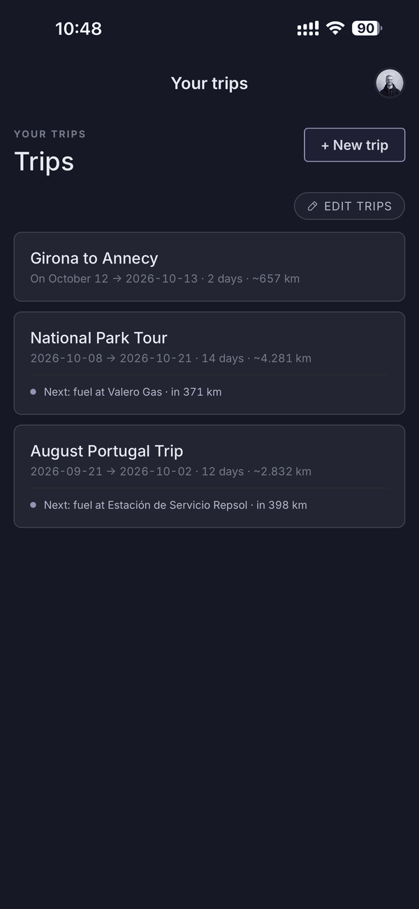

# Feral Travels

Road trip planner with Penny. Tell her where you want to go; she creates a dated,
day-by-day plan with routes, rest days and Google Maps links. Change your mind?
You edit the whole thing by chatting — the list and the map are read views that
follow your live GPS position. A second engine, Finn, finds gas stations your
vehicle can actually reach along each day's route; it carries tank state across
days and attaches a one-line reason to every stop it forces. Live at
[feraltravels.com](https://www.feraltravels.com) on the web, with a native iOS
client in [`mobile/`](mobile/).

<p align="left">
  
  
  
  
</p>

## Run it locally

You need Node 20+, a Neon Postgres database, and keys for Anthropic, Google Maps
Platform and Resend.

```bash
npm install
cp .env.example .env     # every var is commented in there
npm run db:migrate       # apply Drizzle migrations to your database
npm run dev              # http://localhost:3000
```

`npm run test` runs the Vitest suite and `npm run e2e` runs Playwright against a
local server. [`CLAUDE.md`](CLAUDE.md) is the authoritative map of the codebase —
architecture, schema, Penny's tools, the invariants, and the reasoning behind
every non-obvious decision.

## Try it without signing up

There is a shared demo account so you don't have to create one. On
[feraltravels.com](https://www.feraltravels.com) choose **Email me a 6-digit
code**, enter `appletest@feraltravels.com`, and type `000000` as the code. No
inbox is involved — that one address has a fixed code. It is an ordinary account
in every other respect: everyone who signs in lands in the same trips, so treat
it as a sandbox and don't put anything you care about in it.
